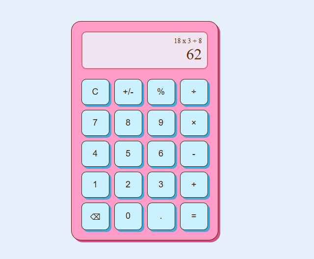

# CSS Grid Calculator – UI Slicing

This project is a CSS-based implementation of a calculator layout using CSS Grid. The design is inspired by Kateryna Loi’s Daily UI #4 - Calculator on Dribbble. The main goal is to practice UI slicing and layout structuring using modern CSS techniques, with a focus on clean, responsive grid systems.

## Preview



## Getting Started
1. Clone this project:
```
git clone https://github.com/ranandasatria/fgo24-css-calculator
```

2. Install the depedencies:
```
npm install
```

3. Run the project:
```
npm run dev
```

4. The project will be runnning at:
``` 
http://localhost:8080
```

## Depedencies

This project uses Node.js. Make sure you have Node.js installed on your machine.

- live-server: to simulate an HTTP server in a local environment.

## How to contribute

Please open a Pull Request (PR) to contribute to this project.
Your PR will be reviewed and merged if necessary.

## License

This project following MIT License.

## Copyright
&copy; 2025 Kodacademy


